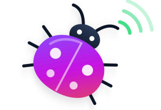

<a id="socketio-client-for-kotlin-and-android"></a>
<h1 align="center">Socket.IO Client for Kotlin &amp; Android</h1>

<p align="center">
  
</p>

<p align="center">
  <strong>Real-time events. Native Android networking. Coroutines all the way.</strong><br>
  Socket.IO 4 for Android and the JVM, built on OkHttp and Kotlin coroutines.<br>
  Network-aware, lifecycle-aware and checked against the pinned JavaScript client.
</p>

<p align="center">
  <a href="https://github.com/kaeferfreund/socketio-socket.io-client-kotlin/actions/workflows/ci.yml?query=branch%3Amain"></a>
  <a href="gradle/libs.versions.toml"></a>
  <a href="#requirements"></a>
  <a href="#requirements"></a>
  <a href="LICENSE"></a>
</p>

<p align="center">
  <a href="#quick-start"><strong>Quick start</strong></a> ·
  <a href="Documentation/README.md">Documentation</a> ·
  <a href="#why-this-library">Why this library?</a> ·
  <a href="Documentation/Guides/Migration.md">Migration from Java</a> ·
  <a href="PARITY.md">JavaScript parity</a>
</p>

---

Send and receive named events, exchange binary payloads, request acknowledgements
and reconnect after interruptions. HTTP long-polling and the WebSocket upgrade are
handled by the client; your application works with `SocketManager` and `Socket`,
with callbacks or with `suspend` functions and `Flow`s.

**This is a Socket.IO client, not a general-purpose WebSocket library.** It needs a
Socket.IO 4 server. This repository is an independent community project, not an
official Socket.IO release. It is the Kotlin counterpart of
[kaeferfreund/socket.io-client-swift](https://github.com/kaeferfreund/socket.io-client-swift):
same reference, same test method, same fixtures wherever possible.

## Why this library?

We needed a client our Android apps could rely on in the field, that behaves
like our web client, and that uses the platform instead of working around it.

| Why we built it | What it does instead |
| --- | --- |
| **[socketio/socket.io-client-java](https://github.com/socketio/socket.io-client-java)**<br>Maintenance has slowed to fixes; the engine is older still. | The latest release is 2.1.2; its [engine.io-client-java](https://github.com/socketio/engine.io-client-java) dependency is still 2.1.0. This library ports the current JavaScript client (4.8.x) line by line and pairs every fix with a regression test. |
| **Features the Java client does not have** | Connection state recovery, a dynamic `AuthProvider` evaluated for every connect, the ordered `retries` queue with `ackTimeout`, cancellable `suspend` acknowledgements, `tryAllTransports`, volatile emits and configurable buffer and parser limits. |
| **Callbacks and `org.json` instead of Kotlin** | `suspend fun emitWithAck`, `StateFlow`/`SharedFlow` for state and events, `kotlin.time.Duration` everywhere and an immutable `SocketIOValue` model. `org.json` adapters remain available for migration. |
| **Mobile networks are not a data center** | The Android module follows `ConnectivityManager`: it drops connections on the lost network at once, reconnects the moment a network returns, binds sockets to the active network, pauses in the background and measures heartbeats with `elapsedRealtime` so Doze is detected. |
| **Web and native clients should agree** | Supported behaviour is checked against the pinned JavaScript reference: its test declarations are mapped to Kotlin tests that must pass in CI, and the parser is compared byte-for-byte with the real JavaScript decoder. |

Maintenance snapshot, checked **2026-09-24**: the latest default-branch commits are
[2025-08-11 for socketio/socket.io-client-java](https://github.com/socketio/socket.io-client-java/commit/eb438de0f7038a075db4c7eff53fd0e7f13116ce)
and [2025-08-11 for socketio/engine.io-client-java](https://github.com/socketio/engine.io-client-java/commit/5d02ea0cedb8ed8e959fa839b5609e5bb0c809e2),
both CI maintenance; the latest releases are
[socket.io-client 2.1.2 (2025-02-18)](https://github.com/socketio/socket.io-client-java/releases/tag/socket.io-client-2.1.2)
and [engine.io-client 2.1.0 (2022-07-10)](https://github.com/socketio/engine.io-client-java/releases/tag/engine.io-client-2.1.0).
These are dated observations, not a statement about the maintainers' future plans.
The [migration guide](Documentation/Guides/Migration.md) maps the Java API to this one.

## Requirements

| Component | Minimum / supported range |
| --- | --- |
| Language | Kotlin 2.4 (explicit API mode), JVM bytecode 17 |
| Android | `minSdk` 26 (Android 8.0), compiled against API 37 |
| JVM | Java 17 or newer (server-side Kotlin, tests, tools) |
| Server | Socket.IO 4.x, Engine.IO 4 |
| Transports | HTTP long-polling and WebSocket (OkHttp 5); no WebTransport |

See [compatibility](Documentation/Guides/Compatibility.md) for protocol boundaries.

## Installation

The library is split into small modules. Android apps need one dependency:

```kotlin
// settings.gradle.kts
dependencyResolutionManagement {
    repositories {
        mavenCentral()
        maven("https://maven.pkg.github.com/kaeferfreund/socketio-socket.io-client-kotlin") {
            credentials {
                username = providers.gradleProperty("gpr.user").orNull
                password = providers.gradleProperty("gpr.key").orNull
            }
        }
    }
}

// app/build.gradle.kts
dependencies {
    implementation("io.github.kaeferfreund.socketio:socketio-android:1.0.0")
}
```

<details>
<summary><strong>Which module do I need?</strong></summary>

| Module | Use it for |
| --- | --- |
| `socketio-android` | Android apps: everything below plus network, lifecycle, TLS/KeyChain and logging integration |
| `socketio-okhttp` | JVM applications: the OkHttp transports and `TlsPolicy` |
| `socketio-client` | The protocol core without any HTTP stack (bring your own transport) |
| `socketio-serialization` | Optional: `@Serializable` classes in and out of events |
| `socketio-testing` | Test utilities: an in-memory Socket.IO server and a Node fixture launcher |

</details>

GitHub Packages requires a token with `read:packages` even for public packages;
Maven Central publication is planned for 1.1. A version requirement installs a
**published release**, not the development branch you are viewing; the
[changelog](CHANGELOG.md) lists what each release contains.

## Quick start

Create the manager once (for example in a `ViewModel` or your DI graph), register
listeners in the `socket(...) { }` block — it runs before the connection starts —
and close the manager when you are done. Like the JavaScript client, the manager
connects on creation (`autoConnect`); listener callbacks arrive on the main thread.

<!-- quick-start:begin -->
```kotlin
import android.content.Context
import io.github.kaeferfreund.socketio.Socket
import io.github.kaeferfreund.socketio.SocketManager
import io.github.kaeferfreund.socketio.SocketManagerOptions
import io.github.kaeferfreund.socketio.android.android
import kotlin.time.Duration.Companion.seconds

class RealtimeClient(context: Context, url: String) {
    private val manager = SocketManager(url, SocketManagerOptions { android(context) })

    private val socket: Socket =
        manager.socket("/") {
            onConnect { println("Connected as $id") }
            onDisconnect { reason, _ -> println("Disconnected: ${reason.wireValue}") }
            onConnectError { error -> println("Connection failed: ${error.message}") }
            on("message") { event -> println("Received: ${event.args}") }
        }

    fun send(message: String) {
        socket.emit("message", message)
    }

    /** Suspends until the server acknowledges, or throws after five seconds. */
    suspend fun ask(question: String): String? = socket.timeout(5.seconds).emitWithAck("question", question).firstOrNull()?.string

    fun close() = manager.close()
}
```
<!-- quick-start:end -->

CI compiles this example in an independent Gradle consumer project against the
published artifacts. The [getting-started guide](Documentation/Guides/GettingStarted.md)
expands the walkthrough, including a plain-JVM variant; the
[acknowledgement guide](Documentation/Guides/Acknowledgements.md) covers callbacks,
`suspend` acknowledgements, timeouts and retries.

## Find the right guide

| Task | Guide |
| --- | --- |
| Receive/send events, binary payloads, catch-all listeners, `Flow` | [Events and payloads](Documentation/Guides/Events.md) |
| Request acknowledgements, set timeouts, retry safely, cancel | [Acknowledgements and delivery](Documentation/Guides/Acknowledgements.md) |
| Authenticate, use namespaces, reconnect and recover state | [Connection lifecycle](Documentation/Guides/Connections.md) |
| Configure transports, threading, cookies, TLS and limits | [Configuration](Documentation/Guides/Configuration.md) |
| Networks, background policy, Doze, KeyChain, logging, Perfetto | [Android integration](Documentation/Guides/Android.md) |
| Move an app from `socket.io-client-java` | [Migration from Java](Documentation/Guides/Migration.md) |
| Diagnose connection or event problems | [Troubleshooting](Documentation/Guides/Troubleshooting.md) |
| Build, test or contribute to the library | [Contributing](CONTRIBUTING.md) |

The [documentation index](Documentation/README.md) also covers the architecture,
the test strategy, release procedures and the retained review evidence.

## Validation you can inspect

AI assists implementation, review, comparison with the JavaScript client and
regression-test development. Source review and reproducible test results remain
the basis for accepting changes; AI output is not a correctness certificate.

The [CI workflow](.github/workflows/ci.yml) runs the unit suites on virtual time,
the end-to-end suites against real Node servers (HTTP, HTTPS, WS, WSS, mutual TLS),
Robolectric and emulator tests for the Android integration, the parser
differential against the pinned JavaScript decoder, the original upstream Node
suites, API compatibility checks and an independent consumer build of the example
above. The parity gate accepts a mapped JavaScript test only when every Kotlin test
named for it **passed** in that run.

The badge above reports **`main`**, not whichever branch or release you are
reading. Check [Actions](https://github.com/kaeferfreund/socketio-socket.io-client-kotlin/actions)
for the exact revision you plan to use. [PARITY.md](PARITY.md) separates supported
behaviour from API/platform differences and unsupported features, with numbers
produced by the validator. Passing tests do **not** establish universal JavaScript
parity, and emulator runs do not replace field tests on physical devices.

## Important boundaries

Recovery requires a Socket.IO 4.6+ server with `connectionStateRecovery` enabled
and is not guaranteed. Retries can deliver an event more than once, so deduplicate
non-idempotent operations on the server. OkHttp compresses WebSocket messages by
size only; the per-message `compress(false)` flag is carried to the transport but
cannot switch compression off for a single frame. WebTransport and the browser- or
Node-only options are not available. See [PARITY.md](PARITY.md) for the supported
scope and every explicit exclusion.

## Contributing

Bug reports, focused fixes and documentation improvements are welcome. Start with
[CONTRIBUTING.md](CONTRIBUTING.md) for the workflow and
[the testing guide](Documentation/Development/Testing.md) for reproducible checks.
Please report issues in [this repository](https://github.com/kaeferfreund/socketio-socket.io-client-kotlin/issues).

## Credits

The protocol logic is a port of the official JavaScript packages
[`socket.io-client`, `engine.io-client`, `socket.io-parser` and `engine.io-parser`](https://github.com/socketio/socket.io)
at a pinned commit. Test fixtures, validation scripts and the review method come from
[kaeferfreund/socket.io-client-swift](https://github.com/kaeferfreund/socket.io-client-swift),
which in turn continues the work of Erik Little and the
[socket.io-client-swift](https://github.com/socketio/socket.io-client-swift) contributors.
Thanks to the Socket.IO maintainers and to the authors of
[socket.io-client-java](https://github.com/socketio/socket.io-client-java), which served
Android apps for years.

## License

[MIT](LICENSE). Provided **as is**, subject to the terms and limitations in the license.
